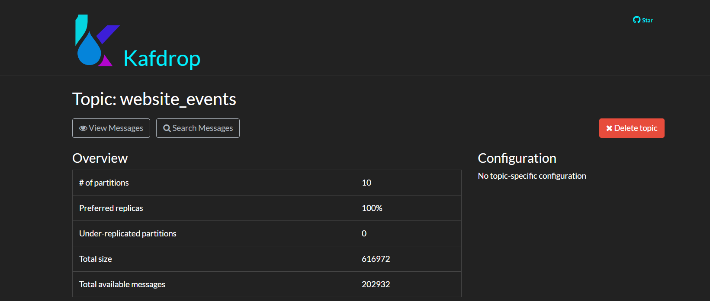
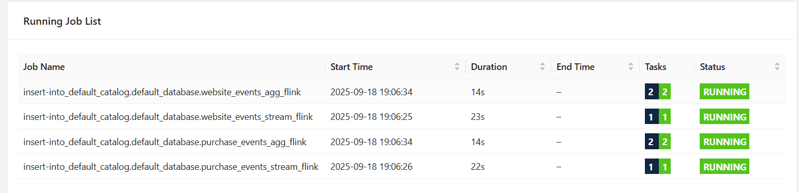
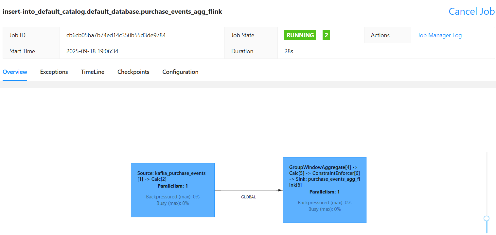
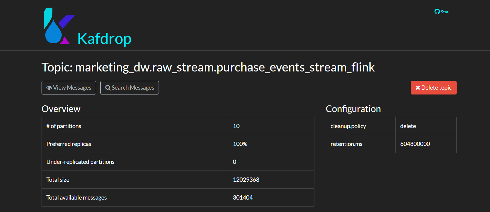
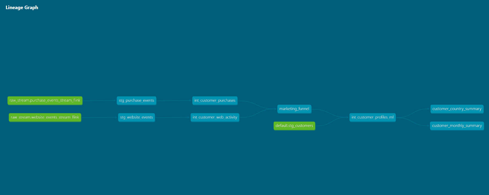
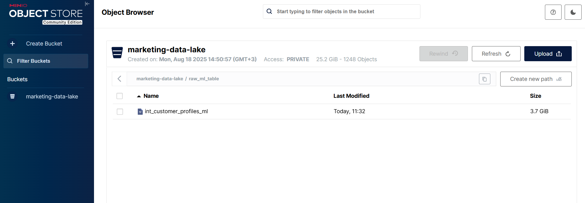
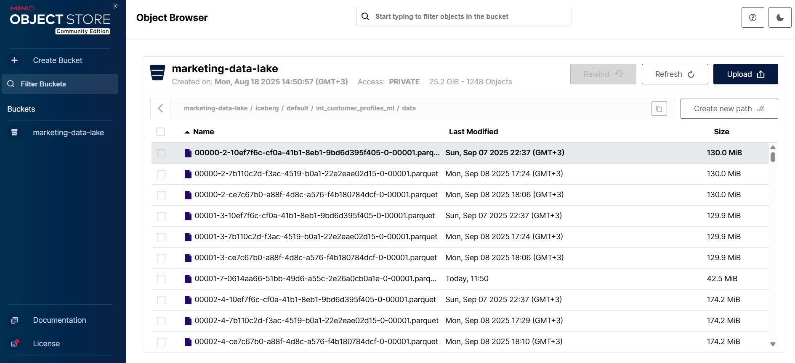
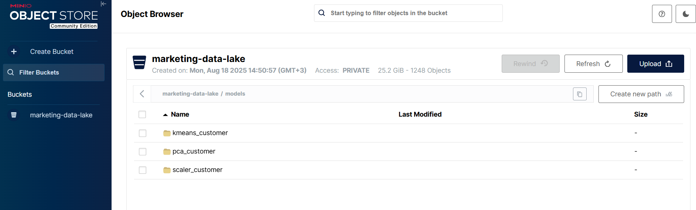

# 📊 Marketing Customer Churn Pipeline Dags: Real-Time & Batch Data Pipeline


## 🚀 Overview

This project demonstrates a **hybrid data pipeline** that combines **real-time streaming** and **batch transformations** for customer analytics.

* **Streaming**: Python simulations generate events (website visits, purchases), which are ingested into **Kafka**. **Flink** consumes from Kafka, processes in real-time, performs aggregations, and stores results in **Postgres**.
* **Batch / dbt**: dbt transforms Postgres data into **staging**, **intermediate**, and **mart** layers. **ClickHouse** is used as an analytical engine with **Debezium CDC** syncing Postgres to ClickHouse. Final marts feed downstream **machine learning** and **analytics**.
* **ML & Spark**: Data is written from ClickHouse/dbt into **Parquet files on MinIO**, read into **Spark**, stored in **Iceberg tables**, and processed with **K-Means clustering**. Cluster-level insights are generated and analyzed in **Jupyter Notebook** for customer journey analysis.
* **Superset**: Used for **BI dashboards**, connecting to ClickHouse and Postgres for real-time and historical visualizations.

The pipeline ensures both **low-latency insights** and **curated historical views**.

---

## 🏗️ Architecture

### Streaming Pipeline

1. Simulated events → Kafka
   

2. Kafka → Flink → Postgres
   

3. Flink performs real-time aggregations
   

### Batch / dbt Pipeline

1. **Postgres → Kafka → ClickHouse** via **Debezium CDC**
   

2. dbt models:

   * **Staging** → Raw tables cleaned & standardized
   * **Intermediate** → Business logic applied
   * **Marts** → Funnel, ML, Customer Monthly, Country
     

3. **ML table ClickHouse → Parquet file → Iceberg → MinIO**
   

4. Spark reads Parquet → stores in Iceberg → runs **K-Means** → stores cluster table and models in Iceberg
   
   

5. Spark runs cluster analysis → avg values for each metric per cluster → ClickHouse table

6. Jupyter Notebook performs additional analysis → track metric differences per cluster over time → **customer journey & movement insights** [Cluster table analysis notebook](python_analysis/cluster_table_analysis.ipynb)

---

## 🔄 Airflow DAGs

### 📡 Pipeline DAG

* `dbt_run_stream_staging`
* `dbt_run_stream_intermediate`
* `dbt_run_funnel_mart`
* `dbt_run_ml_mart`
* `dbt_run_customer_monthly_mart`
* `dbt_run_country_mart`
* `create_s3_int_customer_profiles_ml`
* `spark_iceberg_ml_table`


### 📡 Cluster DAG


### 📡 Stream DAG


The DAGs ensure both **real-time (Flink)** and **batch (dbt + Spark)** layers stay in sync.

---

## 🛠️ Tech Stack

* **Kafka** → Event streaming
* **Flink** → Real-time processing & aggregation
* **Postgres** → Raw + aggregated storage
* **Debezium** → CDC to sync Postgres → ClickHouse
* **ClickHouse** → Analytical database for dbt models
* **dbt** → Batch transformation & marts
* **Parquet / MinIO** → Intermediate storage
* **Apache Spark + Iceberg** → ML-ready tables & clustering
* **Superset** → BI dashboards for visualization
* **Airflow** → Orchestration
* **Docker Compose** → Local environment setup

---

## 📌 How to Run the Project

1. **Clone the repo**

```bash
git clone https://github.com/Ziadashraf301/Marketing_Customer_Churn.git
cd Marketing_Customer_Churn
````

2. **Start services with Docker Compose**

```bash
docker-compose up -d
```

3. **Generate customer profiles data** (100 million records)

```bash
python src/data_generation_scripts/generate_master_customer_ids.py
python src/data_generation_scripts/generate_batch_customers_profile_data.py
```

4. **Generate streaming events**

```bash
make generate_streaming_purchases
make generate_web_events
```

5. **Run Airflow DAGs**

* Access the **Airflow UI** at [http://localhost:8080](http://localhost:8080)
* Or trigger DAGs using the **Airflow CLI**

6. **Explore BI dashboards in Superset**

* Open Superset at [http://localhost:8088](http://localhost:8088) and navigate to the prebuilt dashboards for real-time and batch analytics.


## 🔌 Ports

| Service               | Port |
| --------------        | ---- |
| Airflow Web UI        | 8080 |
| Superset              | 8088 |
| marketing_dw_postgres | 5432 |
| postgres-superset     | 5435 |
| postgres_airflow      | 5436 |
| ClickHouse            | 8123 |
| Pyspark               | 4040 |
| Kafka Broker          | 9092 |
| kafdrop               |19000 |
| Flink Web UI          | 8081 |
| MinIO                 | 9000 |

---

## 📊 BI Dashboards (Superset)

* **Real-Time Metrics** → aggregated KPIs from Flink/Postgres


* **Country & Monthly Reports** → Clickhouse using dbt


---

## 🤖 Machine Learning / Analytics

* **Cluster Analysis** → K-Means clusters on customer behavior
* **Feature Store** → Iceberg tables used for ML modeling
* **Jupyter Notebook** → further analysis of cluster evolution and customer journey
* **Insights** → track differences per metric per cluster over time for targeted marketing

---


