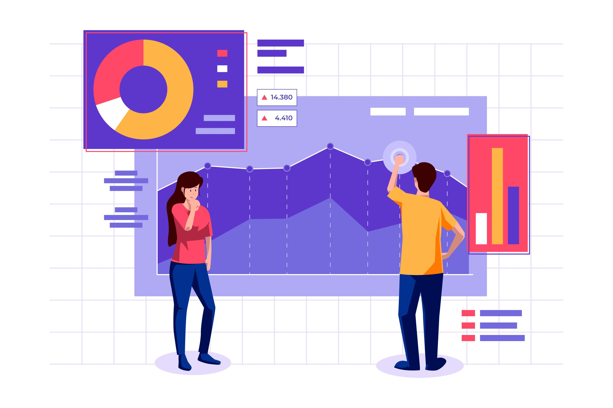
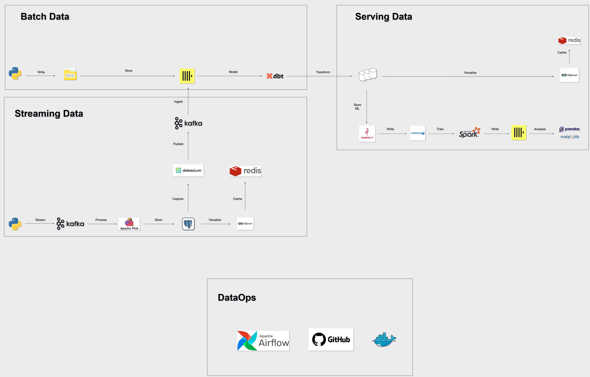
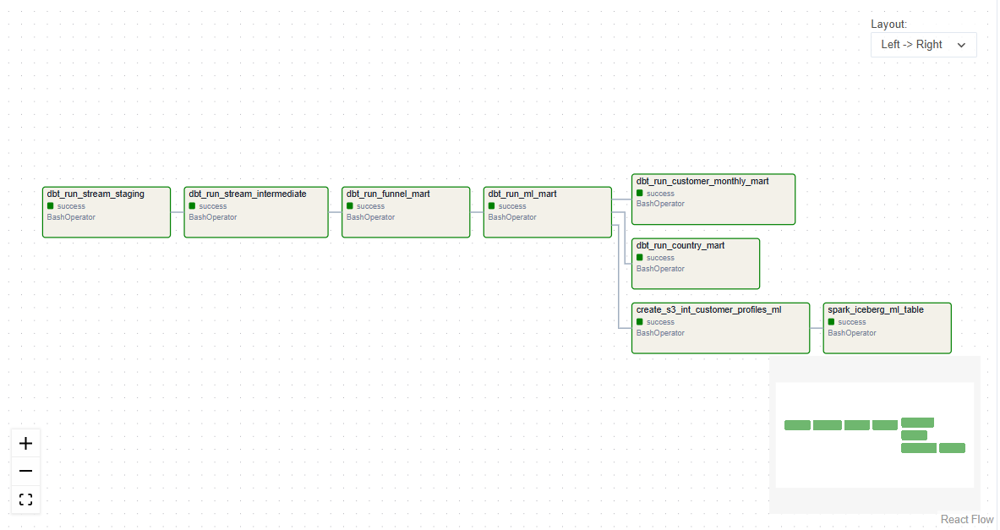
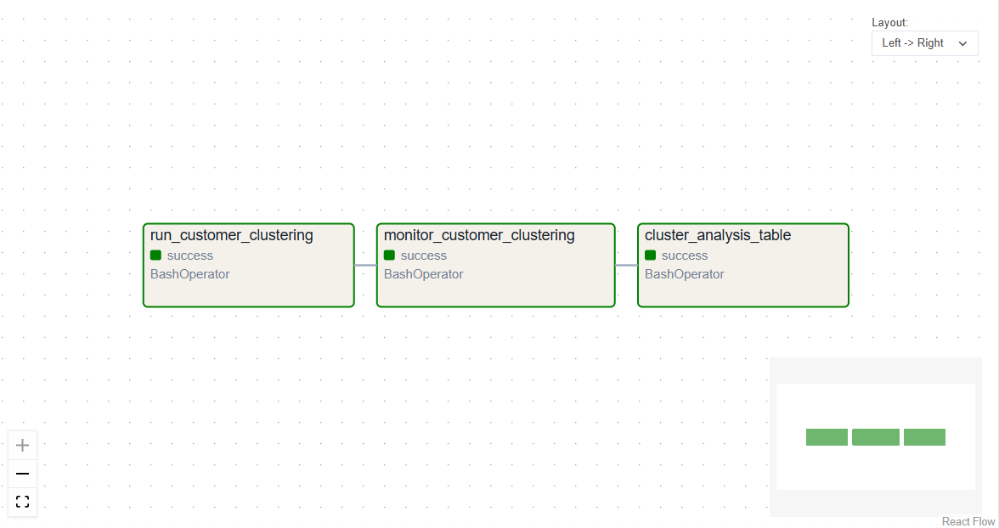
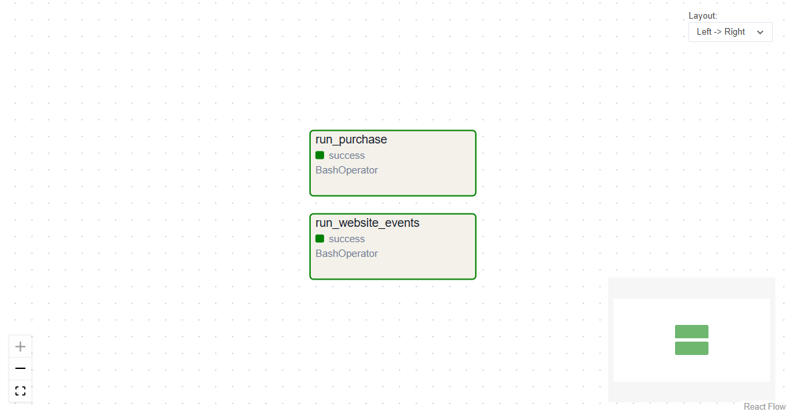
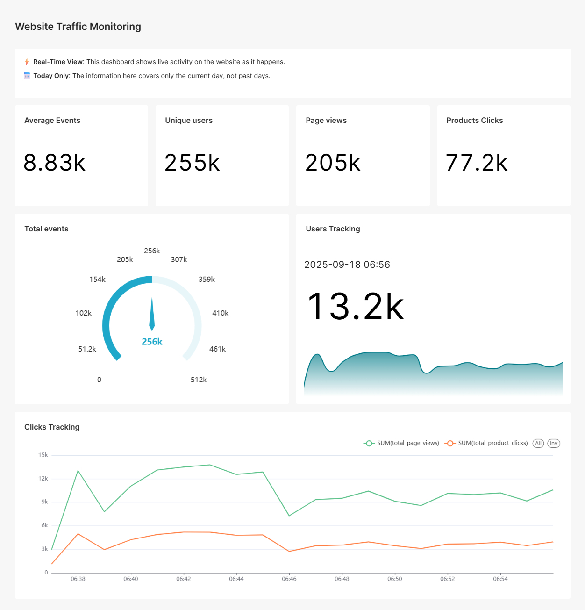
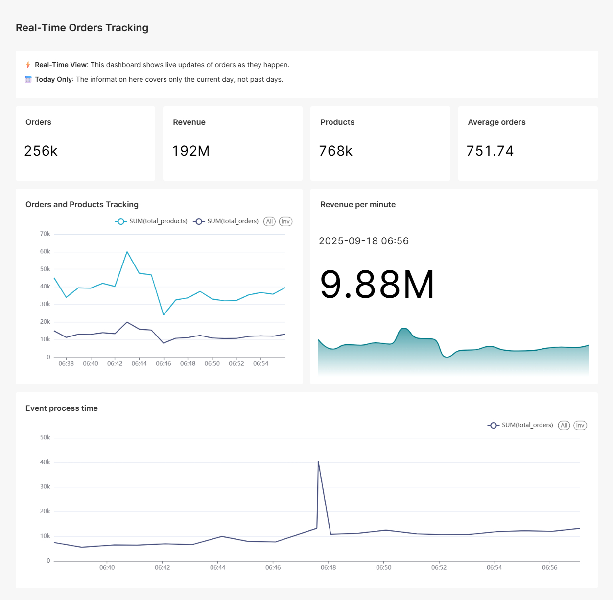
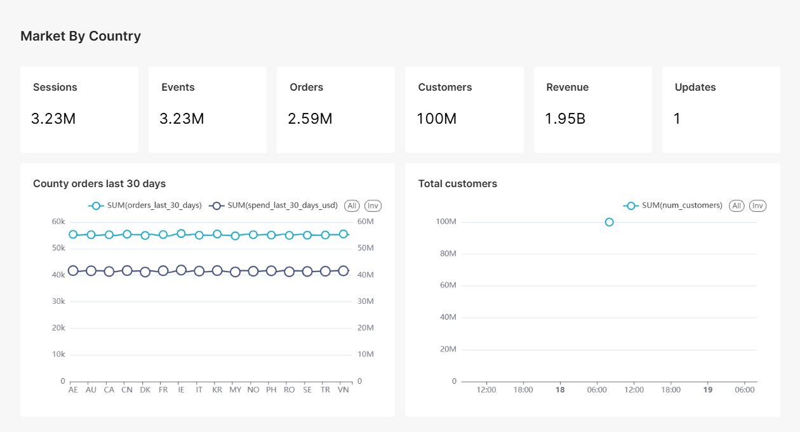
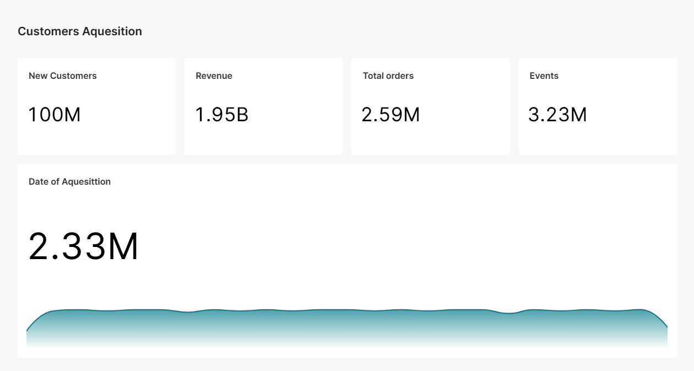

# 📊 Customer Analytics And Churn Pipeline: Real-Time & Batch Data Pipeline



## 💼 Business Problem

Customer churn is one of the biggest challenges in marketing and growth. Companies often spend **5–7x more** to acquire a new customer than to retain an existing one. Without timely insights, businesses struggle to:

* Detect early signs of customer churn
* Segment customers for personalized marketing
* Track real-time customer behavior (website visits, purchases)

---

## 🏆 How This Project Helps the Business

This pipeline directly addresses these problems by:

* ⚡ **Real-time monitoring** of customer interactions (web events, purchases) to quickly spot drops in engagement
* 🎯 Customer segmentation via clustering, enabling churn risk identification, targeted campaigns, upselling, and personalized offers
* 📊 **Dashboards for decision-makers** with both real-time KPIs (page views, product clicks, orders) and historical trends (monthly acquisitions, country performance)
* 💰 **Optimized retention strategies** that reduce churn, increase lifetime value, and improve ROI of marketing campaigns

---

## 🚀 Overview

This project demonstrates a **hybrid data pipeline** that combines **real-time streaming** and **batch transformations** for advanced customer analytics and churn prediction.

* **Streaming** → Python simulations generate **website visits & purchases**, ingested into **Kafka**. **Flink** consumes events, processes them in real time, performs **aggregations**, and stores results in **Postgres**.
* **Batch / dbt** → dbt transforms Postgres data into **staging**, **intermediate**, and **mart** layers. **ClickHouse** serves as the analytical warehouse, with **Debezium CDC** syncing Postgres → ClickHouse.
* **ML & Spark** → Data flows from ClickHouse/dbt → **Parquet on MinIO** → **Iceberg tables** → **Spark ML K-Means** clustering → **customer segments**. Cluster results are analyzed further in **Jupyter Notebook**.
* **Superset** → Provides **interactive dashboards** with both **real-time metrics** and **historical KPIs**.
* **Airflow** → Orchestrates ingestion, dbt transformations, and ML workflows.
* **Docker** → Every service (Kafka, Flink, Postgres, ClickHouse, Superset, Airflow, MinIO) runs inside **Docker containers**.
* **GitHub CI/CD** → Full codebase, workflows, and docs are maintained in GitHub for collaboration and automation.

---

## 🎯 Key Features

- ✅ Hybrid data pipeline (streaming + batch)
- ✅ Real-time ingestion with Kafka & Flink
- ✅ dbt transformations with **incremental models**
- ✅ ClickHouse for ultra-fast analytics
- ✅ ML clustering with Spark & Iceberg
- ✅ Automated orchestration with Airflow
- ✅ BI dashboards with Superset
- ✅ Dockerized environment for easy setup

---

## 📊 Results & Impact

* ⚡ **High throughput** → Handles **10k events/sec (\~36M per hour)** with sub-second latency
* 🛢️ **Optimized storage** → Postgres, ClickHouse, Iceberg + compression for efficiency
* 📉 **Low query latency** → Vectorized queries in ClickHouse for instant aggregations
* 🧩 **Incremental models** → dbt avoids costly full reloads
* 📈 **Adoption-ready dashboards** → Superset tracks **real-time** + **historical KPIs**
* 🤖 **ML insights** → Spark K-Means clusters customers into actionable groups with **95%+ pipeline reliability**
* 🔄 **Automation** → Airflow DAGs ensure ingestion, transformation, and ML retraining run seamlessly
* ⏰ **Fresh data** → Pipelines orchestrated every **6 hours**
* 📧 **Monitoring** → Automatic alerts + summary reports for stakeholders via Emails

---

## 🏗️ Architecture



### Streaming Pipeline

1. **Simulated events** → Kafka
2. **Kafka → Flink → Postgres**
3. **Flink performs aggregations** → stored in Postgres

### Batch / dbt Pipeline

1. Hybrid data pipeline:
   - *Customers Profiles → ClickHouse*
   - *Postgres → Debezium CDC → Kafka → ClickHouse*

2. **dbt** runs transformations:

   * *Staging* → Clean & standardize
   * *Intermediate* → Apply business rules
   * *Marts* → Funnel, ML, Monthly Registration Model, Country Model

3. **ML Pipeline**:

   * ClickHouse marts → Parquet → MinIO → Iceberg
   * Spark ML runs **K-Means** → stores clusters & models
   * Jupyter Notebook → deeper analysis of **customer clusters**

---

## 🔄 Airflow DAGs

* **Pipeline DAG** → dbt + ML workflow



* **Cluster DAG** → ML clustering jobs



* **Stream DAG** → Flink streaming



---

## 🛠️ Tech Stack

* **Kafka** → Event streaming
* **Flink** → Real-time aggregations
* **Postgres** → Source + Row Streams Storege
* **Debezium** → CDC from Postgres → Kafka → ClickHouse
* **ClickHouse** → Analytical warehouse
* **dbt** → Batch transformations
* **Parquet / MinIO** → Data lake storage
* **Apache Spark + Iceberg** → ML-ready tables + clustering
* **Superset** → BI dashboards
* **Airflow** → Orchestration
* **Docker Compose** → Environment setup
* **Github** → CI/CD

---

## 📌 How to Run the Project

### 1. Clone the repo

```bash
git clone https://github.com/Ziadashraf301/Customer_Analytics_Churn_Pipeline.git
cd Customer_Analytics_Churn_Pipeline
```

---

### 2. Generate batch data

```bash
make generate_master_customer_ids
make generate_batch_customers_profile_data
```

* Generates **customer IDs** and **batch customer profiles** for analytics.

---

## 🔹 Streaming Pipeline

### 3. Start streaming services

```bash
make streaming_stack
```

Includes:

* Zookeeper, Kafka, Kafdrop
* ClickHouse for streaming ingestion
* Flink (JobManager + TaskManager)
* Airflow scheduler & webserver

> ⏱ Wait 1–2 minutes for services to be ready.

---

### 4. Generate streaming events

```bash
make generate_streaming_purchases
make generate_web_events
```

* These simulate **real-time purchase and web activity**.
* Micro-batched generation ensures memory-safe, high-throughput ingestion.

---

### 5. Register Debezium connectors (CDC)

```bash
# Website events connector
curl -X POST http://localhost:8083/connectors \
-H "Content-Type: application/json" \
-d @debezium/web_event_connector.json

# Purchase events connector
curl -X POST http://localhost:8083/connectors \
-H "Content-Type: application/json" \
-d @debezium/purchase_events_connector.json
```

---

### 6. Run streaming DAGs in Airflow

* Open [http://localhost:8080](http://localhost:8080)
* Trigger streaming pipelines: **web events + purchase events processing**

---

### 7. Explore near real-time dashboards

```bash
make dashboard_stack
```

* Access **Superset** at [http://localhost:8088](http://localhost:8088)
* Visualize live metrics and streaming-based analytics.

---

## 🔹 Batch Pipeline

### 8. Start batch / orchestration stack

```bash
make batch_stack
```

Services:

* **ClickHouse** for batch analytics
* **Airflow** (scheduler + webserver) for orchestrating DAGs
* **PySpark** for large-scale batch computations
* **DBT** for transformations

---

### 9. Trigger batch DAGs in Airflow

* Open [http://localhost:8080](http://localhost:8080)
* Run **batch DAGs** to process historical customer data and generate reports.

Batch jobs include:

* Aggregating historical purchase and web events
* Enriching customer profiles
* Computing churn metrics
* Storing aggregated results in ClickHouse

---

### 10. Explore batch analytics dashboards

```bash
make dashboard_stack
```

* Access Superset at [http://localhost:8088](http://localhost:8088)
* Explore **historical trends, churn metrics, and customer segmentation dashboards**.

---

### 11. Stop batch services

```bash
make batch_stack_down
make down_dashboard_stack
```

Or stop **all Docker services**:

```bash
docker compose down
```

---

## 🔹 Optional: Start all services at once

```bash
docker-compose up -d
```

---

## 🔌 Ports

| Service             | Port  |
| ------------------- | ----- |
| Airflow Web UI      | 8080  |
| Superset            | 8088  |
| Postgres (DW)       | 5432  |
| Postgres (Superset) | 5435  |
| Postgres (Airflow)  | 5436  |
| ClickHouse          | 8123  |
| Spark UI            | 4040  |
| Kafka Broker        | 9092  |
| Kafdrop UI          | 19000 |
| Flink Web UI        | 8081  |
| MinIO               | 9000  |

---

## 📊 BI Dashboards

* **Real-Time Metrics** (Flink + Postgres)




* **Country & Monthly Reports** (ClickHouse via dbt)




---

## 🤖 Machine Learning

* **K-Means clustering** → actionable segments
* **Feature Store** → Iceberg tables
* **Jupyter Notebooks** → customer journey & churn insights
* **Outputs** → cluster tables + ML models

---

## 📚 Documentation

* [dbt Models](dbt/dbt/models/)
* [Airflow DAGs](airflow/dags/)
* [Spark ML Analysis](python_analysis/)

---
